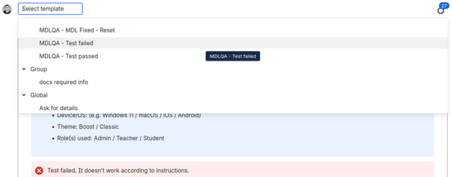

{/* <!-- markdownlint-disable no-inline-html --> */}

A friendly guide for anyone thinking about joining a Moodle QA testing cycle for the first time.

:::note[Next QA Cycle]
The [Moodle 5.3 QA cycle](https://moodle.atlassian.net/jira/dashboards/10612) opens 31 August 2026.
:::

## How to start

**1. Set up your accounts:** create an account on the [Moodle Tracker](https://id.atlassian.com/login) (that's where you will report your test results) and an account on [moodle.org](https://moodle.org/login/index.php). Use the same email address for both accounts. You can do this anytime.

<details>
<summary>Details on setting up your accounts</summary>

**Setting up your account on the Moodle Tracker**

In order to assign tests to yourself and add comments you'll need to create an account on the Moodle Tracker. The Moodle Tracker is Moodle's issue-tracking system; it's how the whole community reports bugs and test results, not just testers. Sign-up takes a couple of minutes.

1. Visit the [Moodle Tracker login page](https://id.atlassian.com/login).
2. From there you can log in using your Google, Microsoft, Apple, or Slack accounts.
3. If you prefer, you can manually create a new account by entering your email address and clicking "Sign up".
4. Enter the 6-digit code emailed to you to proceed with the account creation.
5. Enter your name and click "Create account".

**Setting up your account on moodle.org**

If you don't already have a moodle.org account, create one using the same email address as your Tracker account; this is how we credit you and generate your tester badge.

1. Visit [moodle.org](https://moodle.org/login/index.php) and click "Create new account".
2. Enter your age and country and click "Proceed".
3. Read the site's policies and cookie policy, click the checkboxes to agree and then click "Next".
4. Fill in the form and click "Create my account".

</details>

**2. Once the QA cycle is open, choose a test to run:** browse the lists of tests for beginners grouped by number of steps (short, medium, long), or explore the full QA testing dashboard. Once you find a test you like, assign it to yourself on the Moodle Tracker.

<details>
<summary>Details on picking your first test</summary>

Once a cycle is open, check the preselected test cases list. This is where you'll see unassigned tests that don't require a technical background. Test cases are written as a series of steps with an expected result.

You will see three columns:

- **Key**: indicates the number of the test
- **Summary**: it's the title of the test
- **Components**: the part of Moodle the test belongs to (e.g. 'Book activity', 'Quiz'). Particularly useful if you want to focus on an area you're already familiar with.

Here's how to find and assign yourself a test:

1. Browse tests for beginners. We have grouped the list of tests for beginners by number of steps, so you can gauge how long it'll take.
2. Once you find a test you are interested in, click on the MDLQA-XX under the 'Key' column.
3. This opens the test on the Moodle Tracker.
4. Read the whole thing once before assigning it to yourself, so you know what you're aiming for.
5. If you aren't interested, keep browsing tests for beginners.
6. If you're interested, assign it to yourself.

We'd suggest only assigning yourself tests you already have some familiarity with, or are genuinely curious to learn by doing. And you can unassign yourself from a test at any time; no explanation needed.

</details>

[Full list of tests for beginners](https://moodle.atlassian.net/jira/dashboards/10612)

**3. Run the test** in the Moodle QA testing site — the login details are available in the main page.

<details>
<summary>Details on running a test on the shared site</summary>

Moodle QA testing site: [Moodle QA Testing Site](https://qa.moodledemo.net/)

⚠️ Two things worth knowing before you start:

- The site resets hourly at the top of the hour (so at 01:00, 02:00, and so on) so please be mindful if you are running a long test.
- Don't enter any personal or sensitive information into the site.

</details>

**4. Report the test result** on the Moodle Tracker: mark it Pass or Fail, add a short comment about the results, and attach the screenshots.

<details>
<summary>Details on reporting your result</summary>

On the Moodle Tracker, mark the test Pass or Fail. Add a comment using the templates below; you can copy and paste them or use a browser extension.

Reminder: attach a screenshot and a short note if anything didn't work as expected. Your Pass/Fail marks are reviewed directly by the QA lead and used to sign off the release, so nothing you submit disappears into a void.

If something that's not related to the test fails, add the `qa_help_needed` label and leave a comment with your question; we'll get back to you. And if the test instructions themselves seem outdated or unclear, add the `qa_instructions_update` label and note which steps need fixing; that feedback helps the next tester too.

**Template for a failed test**

```
Environment
Site used: QA Testing Site / Local test site (Moodle version: 5.3dev Build: YYYYMMDD)
Browser: (name and version)
Device/OS: (e.g. Windows 11 / macOS / iOS / Android)
Role(s) used: Admin / Teacher / Student

Test failed. It doesn't work according to instructions.
Step that failed: Step #
Expected result: (What should have happened according to the instructions)
Actual result: (Describe precisely what happened, including any error messages or unexpected behavior)
Questions/Doubts: If you are unsure whether this is a bug or just a confusing step, describe your doubts here.

Attached are screenshots or logs showing the failure:
Step 1:
Step 2:
Step #:
At least one screenshot per critical step. Screenshots may be grouped if appropriate.
```

**Template for a passed test**

```
Environment
Site used: QA Testing Site / Local test site (Moodle version: 5.3dev Build: YYYYMMDD)
Browser: (e.g. Firefox 148.0 / Chrome 145.0.7632.117 / Safari 26 / …)
Device/OS: (e.g. Windows 11 / macOS / Ubuntu / iOS / Android 14 / …)
Role(s) used: Admin / Teacher / Student

Works according to instructions. Test passed!

Attached are screenshots for:
Step 1:
Step 2:
Step ..
At least one screenshot per critical step. Screenshots may be grouped if appropriate.

(Please ensure you have attached the files to this Jira issue)

PS By marking this test as PASS, I confirm that I followed the instructions exactly as written; all required preconditions were set up; no additional settings were modified; and the test description is up-to-date and clear.
```

**How to install these templates on the Moodle Tracker (browser extension)**

You can use these templates directly in Jira by installing the "Canned Responses Pro" for Jira browser extension. It's available for:

- [Chrome](https://chromewebstore.google.com/detail/canned-responses-pro-for/abiklfpogpkkcelofcplnokkehjgmchc)
- [Microsoft Edge](https://microsoftedge.microsoft.com/addons/detail/canned-responses-pro-for-/aaihcmfhjhpblfehcjfgadlcaokkaomd)
- [Firefox](https://addons.mozilla.org/en-US/firefox/addon/canned-responses-for-jira/)

After installing the extension, a "Select template" dropdown will appear above the Jira comment editor. From there you can select the templates "MDLQA – Test Passed" and "MDLQA – Test Failed"


</details>

:::note
This guide covers everything a new tester needs. If you'd like the complete picture, the [QA testing documentation](https://moodledev.io/general/development/process/testing/qa) has all the technical specifications.
:::

Thanks for considering this.  Every test result helps, even if it's just one or two.  Welcome aboard, and see you in the cycle 😊

---
